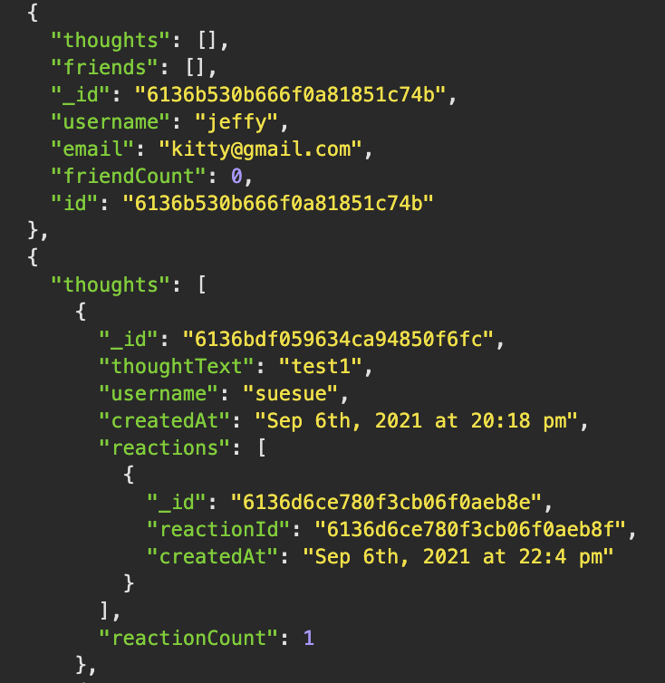

# Social Network API
AS A social media startup
I WANT an API for my social network that uses a NoSQL database
SO THAT my website can handle large amounts of unstructured data

## Table of Contents
* [How it works](#how-it-works)
* [Features](#features)
* [Technoliges Used](#technologies-used)
* [Walkthrough Video](#walkthrough-video)

## How it works:
- WHEN I enter the command to invoke the application, my server is started and the Mongoose models are synced to the MongoDB database
- WHEN I open API GET routes in Insomnia Core for users and thoughts, the data for each of these routes is displayed in a formatted JSON
- WHEN I test API POST, PUT, and DELETE routes in Insomnia Core, I am able to successfully create, update, and delete users and thoughts in my database
- WHEN I test API POST and DELETE routes in Insomnia Core, I am able to successfully create and delete reactions to thoughts and add and remove friends to a user’s friend list

## Features:
- Reaction is not a model, but was used as the ```reaction``` field's subdocument schema in the ```Thought``` model
- Created a virtual called ```friendCount``` that retrieves the length of the user's ```friends``` array field on query
- Created a virtual called ```reactionCount``` that retrieves the length of the thought's ```reactions``` array field on query
### Example:


## Technologies Used:
1. Mongoose
```javascript
thoughtText: {
  type: String,
  required: true,
  min: 1,
  max: 280
},
createdAt: {
  type: Date,
  default: Date.now,
  get: createdAtVal => dateFormat(createdAtVal)
},
username: {
  type: String,
  required: true,
},
reactions: [ReactionSchema]
```

2. validator
```javascript
email: {
  type: String,
  required: true,
  unique: true,
  validate: [ isEmail, 'invalid email']
},
```

## Walkthrough Video
coming soon

